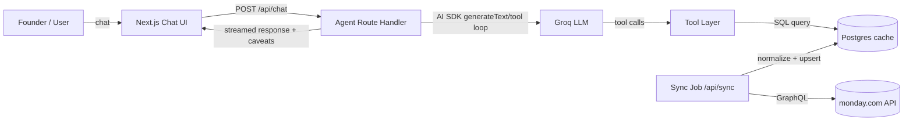

# Architecture — Monday.com BI Agent

## 1. Tech stack (priority order)

| Layer | Choice | Why |
|---|---|---|
| Framework | **Next.js 15 (App Router) + TypeScript** | Single deployable for UI + API routes, native streaming support, Vercel-native hosting for the "hosted link" deliverable |
| UI kit | **shadcn/ui + Tailwind** | Owns the components (no black-box design system), fast to make look bespoke instead of AI-generic |
| LLM | **Groq API**, OpenAI-compatible endpoint | Required by assignment; wired through an OpenAI-compatible client so the provider is swappable |
| Agent/tool-calling | **Vercel AI SDK (`ai` package)** | Native streaming + tool-calling loop against an OpenAI-compatible baseURL — avoids hand-rolling function-calling |
| Database | **PostgreSQL (Neon, serverless)** | Cache/normalize monday.com data; serverless Postgres fits Vercel's deploy model with zero ops |
| ORM | **Drizzle** | SQL-transparent, lightweight, easy to reason about while writing normalization logic by hand |
| Monday.com client | **`graphql-request`** (thin wrapper) | Read-only GraphQL calls; official SDK is unnecessary weight for read-only scope |
| Validation | **Zod** | Schema-validate every monday.com column value and every LLM tool-call input/output at the boundary |
| Charts (leadership brief) | **Recharts** | shadcn-compatible, sufficient for pipeline/ops summary visuals |
| Deployment | **Vercel** | Zero-config Next.js hosting, satisfies "testable without local setup" |

## 2. System overview



**Key design decision:** the agent never queries monday.com's live API mid-conversation. A sync job (on-demand button + scheduled) pulls both boards, normalizes them, and upserts into Postgres with a `synced_at` timestamp. The LLM's tools query Postgres, not monday.com directly. This satisfies "must query monday.com dynamically" (data is never hardcoded, always traceable to a real pull) while avoiding rate limits and giving deterministic, fast tool calls. Every answer states the `synced_at` freshness so the user knows how current the data is.

## 3. App flow

1. User opens the hosted link → chat UI loads, shows last sync time + a "Sync now" affordance.
2. User sends a message → `POST /api/chat`.
3. Route handler builds the system prompt (grounding rules, see `rule.md`) + conversation history, calls the AI SDK with the Groq provider and a fixed set of tools.
4. Model decides which tool(s) to call (e.g., `queryDeals`, `queryWorkOrders`, `joinDealsToWorkOrders`, `getDataQualityReport`).
5. Tools execute typed, parameterized SQL against Postgres (via Drizzle), return structured JSON + a `caveats[]` array for any nulls/exclusions.
6. Model synthesizes a grounded answer citing the tool output; if ambiguity is detected pre-tool-call (per `rule.md` clarify-trigger), it asks a clarifying question instead.
7. Response streams back to the UI; caveats render as a distinct visual element (not buried in prose).
8. On "prepare a leadership update," a dedicated tool (`generateLeadershipBrief`) assembles a structured summary from the same underlying queries and returns markdown, rendered with an "export/copy" affordance.

## 4. Folder structure

```
saroj/
├── app/
│   ├── layout.tsx
│   ├── page.tsx                    # chat entry point
│   ├── api/
│   │   ├── chat/route.ts           # agent endpoint (AI SDK streamText + tools)
│   │   ├── sync/route.ts           # monday.com pull + normalize + upsert
│   │   └── health/route.ts         # sync status, last synced_at
│   └── globals.css
├── components/
│   ├── chat/
│   │   ├── chat-window.tsx
│   │   ├── message-bubble.tsx
│   │   ├── caveat-banner.tsx       # dedicated data-quality callout component
│   │   └── leadership-brief-card.tsx
│   ├── ui/                         # shadcn primitives
│   └── layout/
│       ├── sidebar.tsx
│       └── sync-status-badge.tsx
├── lib/
│   ├── ai/
│   │   ├── provider.ts             # Groq client via OpenAI-compatible baseURL
│   │   ├── system-prompt.ts        # grounding + clarify-trigger rules
│   │   └── tools/
│   │       ├── query-deals.ts
│   │       ├── query-work-orders.ts
│   │       ├── join-deals-work-orders.ts
│   │       ├── data-quality-report.ts
│   │       └── generate-leadership-brief.ts
│   ├── monday/
│   │   ├── client.ts               # graphql-request wrapper, auth header
│   │   ├── queries.ts              # GraphQL query strings (read-only)
│   │   └── types.ts
│   ├── normalize/
│   │   ├── dates.ts                # multi-format date → ISO
│   │   ├── sectors.ts              # alias → canonical sector map
│   │   └── text.ts                 # trim/case/dedupe helpers
│   ├── db/
│   │   ├── schema.ts               # Drizzle schema
│   │   ├── client.ts
│   │   └── queries/
│   │       ├── deals.ts
│   │       └── work-orders.ts
│   └── validation/
│       └── schemas.ts              # Zod schemas for monday.com rows + tool I/O
├── drizzle/                        # migrations
├── decision-log.md
├── prd.md
├── architecture.md
├── rule.md
├── phase.md
├── design.md
└── README.md
```

## 5. Data model (Postgres cache)

```
work_orders
  id                 text primary key      -- monday.com item id
  name               text
  status             text                  -- normalized enum
  raw_status         text                  -- original value, for audit
  sector              text                 -- canonical
  raw_sector          text
  start_date          date null
  due_date            date null
  account_name        text                 -- join key to deals
  is_incomplete        boolean              -- true if any required field was null pre-normalization
  synced_at            timestamptz

deals
  id                  text primary key
  name                 text
  stage                text                 -- normalized enum
  raw_stage            text
  sector               text
  raw_sector           text
  value                numeric null
  close_date           date null
  account_name         text
  is_incomplete        boolean
  synced_at            timestamptz

sync_runs
  id                   serial primary key
  started_at           timestamptz
  finished_at          timestamptz
  boards_synced        text[]
  rows_upserted        int
  errors               jsonb null

conversations / messages   -- optional, for chat history persistence across reloads
```

`account_name` is the fuzzy join key between boards (normalized via `lib/normalize/text.ts`) since the two boards won't share a hard foreign key — this is a documented assumption, not a discovered schema fact (see `decision-log.md`).

## 6. Tool contract (LLM ↔ system boundary)

Every tool:
- Takes a **typed, Zod-validated** input (e.g., `{ sector?: string; stage?: string; dateRange?: {from, to} }`).
- Returns `{ data: T[], caveats: string[], synced_at: string }` — caveats are structural, not left for the model to invent.
- Never returns free-text the model could misattribute as computed — all aggregation (sums, counts, rates) happens in SQL/TS, not by asking the model to do arithmetic over raw rows.

## 7. Deployment topology
- Vercel: Next.js app (UI + API routes + scheduled sync via Vercel Cron).
- Neon: Postgres, single database, one schema.
- Secrets: `MONDAY_API_TOKEN`, `GROQ_API_KEY`, `DATABASE_URL` — Vercel environment variables, never client-exposed (`NEXT_PUBLIC_*` prefix is never used for these).
